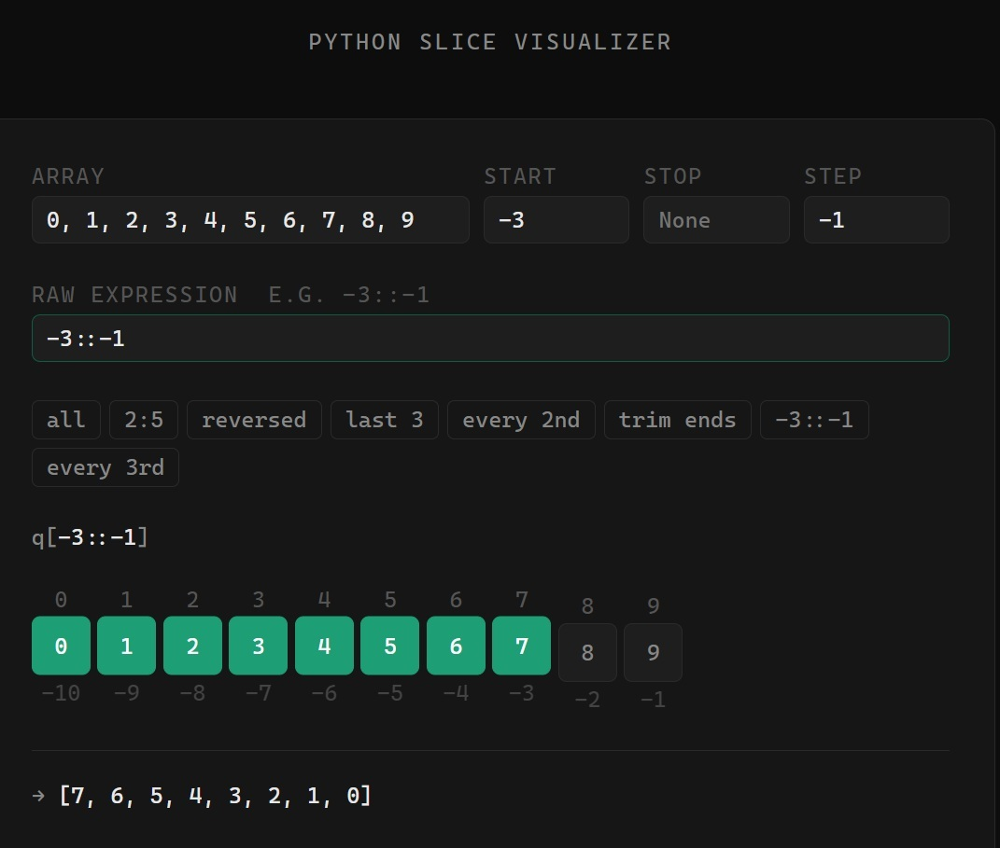

# Python Slice Visualizer

Interactive visualizer for Python slice expressions `q[start:stop:step]`.

Built to make negative indices and reverse steps intuitive. No server, no dependencies, no build step.

## Demo



## Usage

Open `slice_viz.html` in a browser.

- Edit the array (comma-separated values)
- Set `start`, `stop`, `step` individually, or type a raw expression like `-3::-1`
- Selected elements lift and highlight in green
- Positive indices shown above each element, negative below

## Preset expressions

| Expression | Effect |
|---|---|
| `::` | all elements |
| `2:5` | elements at index 2, 3, 4 |
| `::-1` | reversed |
| `-3:` | last three |
| `::2` | every second element |
| `1:-1` | trim first and last |
| `-3::-1` | from third-last, backwards |
| `::3` | every third element |

## Slice semantics

```
q[start:stop:step]
```

- All parameters are optional, defaulting to `None`
- Negative indices count from the end: `-1` is the last element
- `step` can be negative to traverse in reverse
- `step=0` is an error
- Out-of-range indices are clamped, not errors

## Files

- `slice_viz.html` — standalone visualizer, open directly in browser
- `slice_viz.ts` — same logic as a typed TypeScript module with CLI output

## Running the TypeScript version

```bash
npx tsx slice_viz.ts
```
